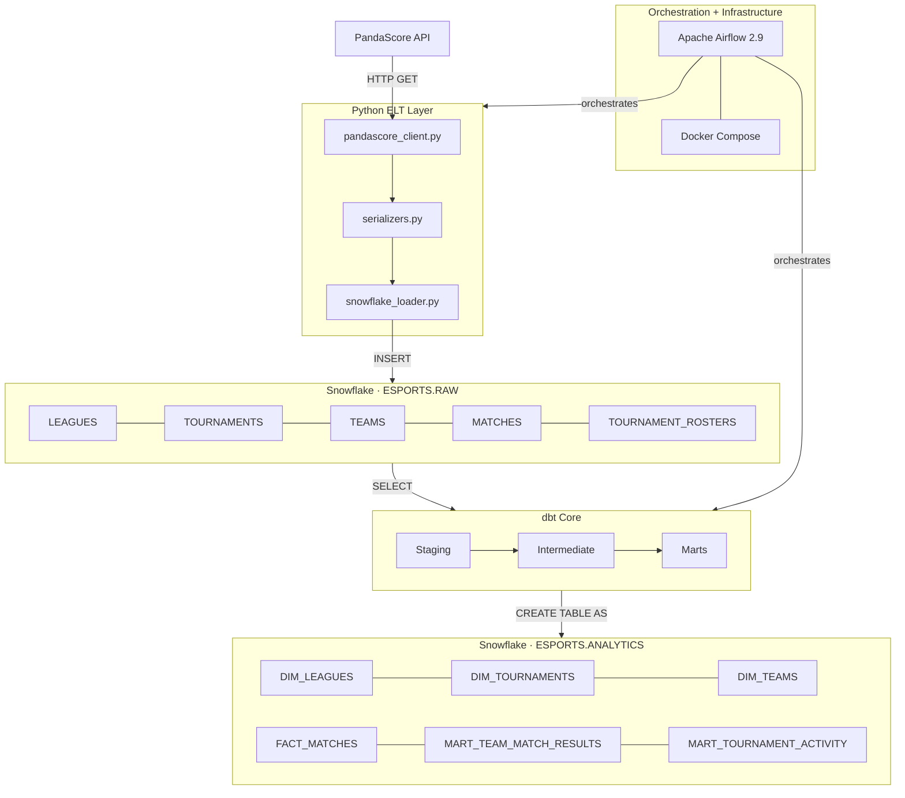
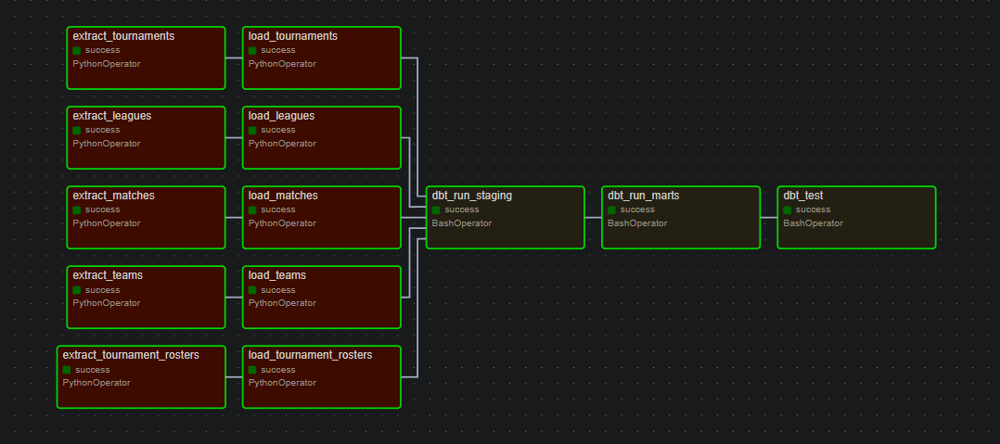
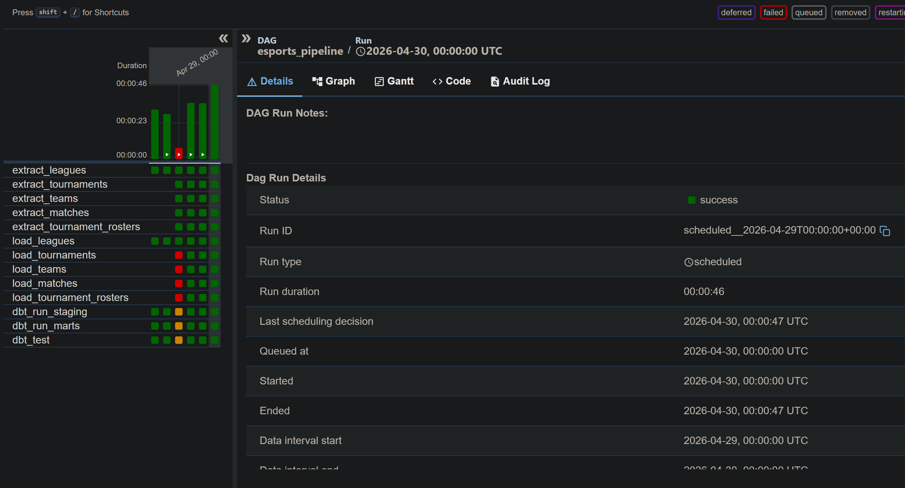
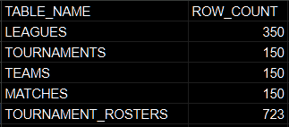
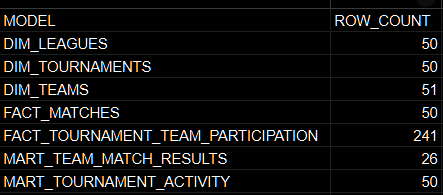
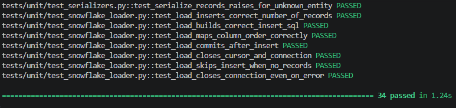

# Esports ELT Pipeline — PandaScore Data Warehouse

## Overview

An end-to-end **ELT pipeline** that extracts esports data from the **PandaScore REST API**, loads it into a **Snowflake** raw layer, and transforms it into an analytics-ready data warehouse using **dbt Core**. The full pipeline is orchestrated by **Apache Airflow** running in **Docker**.

This project demonstrates:
- Modern ELT architecture with clear separation of extract, load, and transform responsibilities
- Snowflake raw layer design with lightly normalized tables
- dbt staging, intermediate, and mart layer modeling
- Airflow DAG orchestration with XCom-based task communication
- Dockerized local development environment
- Unit testing with pytest and mocked external dependencies
- CI/CD with GitHub Actions

## Architecture



| Layer | Technology | Description |
|---|---|---|
| **Extraction** | Python, Requests | Fetches leagues, tournaments, teams, matches, and rosters from PandaScore API |
| **Raw Load** | Python, Snowflake Connector | Inserts lightly normalized records into `ESPORTS.RAW.*` tables |
| **Transformation** | dbt Core | Staging deduplication → intermediate unpivoting → mart aggregations |
| **Warehouse** | Snowflake | Cloud data warehouse hosting RAW and ANALYTICS schemas |
| **Orchestration** | Apache Airflow 2.9 | DAG manages extract → load → dbt run → dbt test task chain |
| **Containerization** | Docker Compose | Airflow webserver, scheduler, and Postgres metadata DB |
| **CI/CD** | GitHub Actions | Automated unit tests on every push |

## Pipeline DAG

The Airflow DAG runs all five entities in parallel through extract and load, then hands off to dbt sequentially:


*All 13 tasks passing — parallel extract/load fan-in to sequential dbt run*


*Successful pipeline run history in the Airflow UI*

## Data Model

### Raw Layer — `ESPORTS.RAW`

Five lightly normalized tables, one per entity. Each row represents one record as received from the API with an `ingested_at` audit timestamp.

| Table | Grain | Key Columns |
|---|---|---|
| `LEAGUES` | One row per league | `league_id`, `league_name`, `league_slug` |
| `TOURNAMENTS` | One row per tournament | `tournament_id`, `league_id`, `tournament_status`, `begin_at`, `end_at` |
| `TEAMS` | One row per team | `team_id`, `team_name`, `team_acronym`, `team_location` |
| `MATCHES` | One row per match | `match_id`, `tournament_id`, `opponent_1_id`, `opponent_2_id`, `winner_id` |
| `TOURNAMENT_ROSTERS` | One row per tournament-team pair | `tournament_id`, `team_id` |



*Raw layer row counts across all 5 entities after pipeline run*

### Analytics Layer — `ESPORTS.ANALYTICS`

| Model | Layer | Description |
|---|---|---|
| `stg_leagues` | Staging | Deduplicated leagues via `ROW_NUMBER()` window function |
| `stg_tournaments` | Staging | Deduplicated tournaments |
| `stg_teams` | Staging | Deduplicated teams |
| `stg_matches` | Staging | Deduplicated matches |
| `stg_tournament_rosters` | Staging | Deduplicated tournament-team pairs |
| `int_match_opponents` | Intermediate | Unpivots opponent_1/opponent_2 into one row per match-team pair |
| `dim_leagues` | Mart | League dimension table |
| `dim_tournaments` | Mart | Tournament dimension table |
| `dim_teams` | Mart | Team dimension table |
| `fact_matches` | Mart | Match fact table with opponent and outcome columns |
| `fact_tournament_team_participation` | Mart | Team participation per tournament |
| `mart_team_match_results` | Mart | One row per team per match with win/loss outcome |
| `mart_tournament_activity` | Mart | Tournament enriched with team count and match count aggregations |



*Analytics layer row counts across all 7 dbt models after pipeline run*

## Tech Stack

`Python` · `Snowflake` · `dbt Core` · `Apache Airflow` · `Docker` · `PostgreSQL` · `GitHub Actions` · `pytest`

## How to Run

### Prerequisites
- Python 3.12+
- Docker Desktop
- [PandaScore API Key](https://pandascore.co/)
- Snowflake account (free trial works)

### 1. Clone & Configure

```bash
git clone https://github.com/JoeAlexBV/esports-elt-pipeline.git
cd esports-elt-pipeline
cp .env.example .env
```
Fill in your credentials in .env:
```text
PANDASCORE_API_KEY=your_key_here

SNOWFLAKE_ACCOUNT=your_account_identifier
SNOWFLAKE_USER=your_user
SNOWFLAKE_PASSWORD=your_password
SNOWFLAKE_WAREHOUSE=COMPUTE_WH
SNOWFLAKE_DATABASE=ESPORTS
SNOWFLAKE_SCHEMA_RAW=RAW
SNOWFLAKE_SCHEMA_ANALYTICS=ANALYTICS
SNOWFLAKE_ROLE=ACCOUNTADMIN
```
~
### 2. Initialize Snowflake

Run sql/init_snowflake.sql in your Snowflake worksheet to create the database, schemas, warehouse, and all raw tables:
```sql
-- Run this once in your Snowflake UI
-- Creates ESPORTS database, RAW + ANALYTICS schemas, and all 5 raw tables
-- I had to run this in chunks
```

### 3. Configure dbt

```bash
cp dbt/esports_warehouse/profiles.yml.example dbt/esports_warehouse/profiles.yml
```
Verify the connection:
```bash
dbt debug --project-dir dbt/esports_warehouse --profiles-dir dbt/esports_warehouse
```

### 4. Build the Docker Image

```bash
docker compose build
```

### 5. Start Airflow

```bash
# Initialize the metadata DB and create admin user
docker compose up airflow-init

# Start all services
docker compose up
```

Open http://localhost:8080 and log in with admin / admin.


### 6. Trigger the Pipeline

In the Airflow UI:

1. Unpause the esports_pipeline DAG
2. Click ▶ Trigger DAG to run manually

The full pipeline will extract all 5 entities, load to Snowflake RAW, run all dbt models, and run all dbt tests.


### 7. Verify Results

```sql
SELECT COUNT(*) FROM ESPORTS.ANALYTICS.DIM_LEAGUES;
SELECT COUNT(*) FROM ESPORTS.ANALYTICS.FACT_MATCHES;
SELECT COUNT(*) FROM ESPORTS.ANALYTICS.MART_TEAM_MATCH_RESULTS;
```

## Testing

### Unit Tests

Run inside the Docker container — no credentials required, all external calls are mocked:
```bash
docker compose exec airflow-webserver pytest tests/unit/ -v
```



*34 unit tests passing across all three modules*

### Test Coverage

| File | Tests | What's Covered |
|---|---|---|
| `test_pandascore_client.py` | 10 | Happy path, pagination, auth headers, HTTP errors, bad response shape |
| `test_serializers.py` | 16 | All 5 serializers, null/missing fields, opponent edge cases, roster fan-out |
| `test_snowflake_loader.py` | 8 | Insert SQL shape, column ordering, commit, connection cleanup, empty records |


### Integration Tests

Requires live credentials. Verifies real API connectivity and Snowflake data presence:

```bash
pytest tests/integration/ -v -s
```


## Project Structure:

```text
├── dags/                          # Airflow DAG definitions
├── dbt/esports_warehouse/
│   ├── models/
│   │   ├── staging/               # Source deduplication models
│   │   ├── intermediate/          # Match opponent unpivot
│   │   └── marts/                 # Dims, facts, and aggregated marts
│   ├── dbt_project.yml
│   └── profiles.yml.example
├── infrastructure/docker/         # Dockerfile for custom Airflow image
├── src/
│   ├── extract/                   # PandaScore API client + serializers
│   ├── load/                      # Snowflake loader + table configs
│   ├── config/                    # Centralized settings
│   └── utils/                     # Logging and helpers
├── sql/                           # Snowflake table DDL
├── tests/
│   ├── unit/                      # Mocked unit tests
│   └── integration/               # Live connectivity tests
├── docs/                          # Diagrams and screenshots
├── .github/workflows/             # CI/CD pipeline
├── docker-compose.yml
├── requirements.txt
├── pyproject.toml
└── Makefile
```

## License

This project is for educational and portfolio purposes.
Esports data provided by the [PandaScore API](https://www.pandascore.co/)